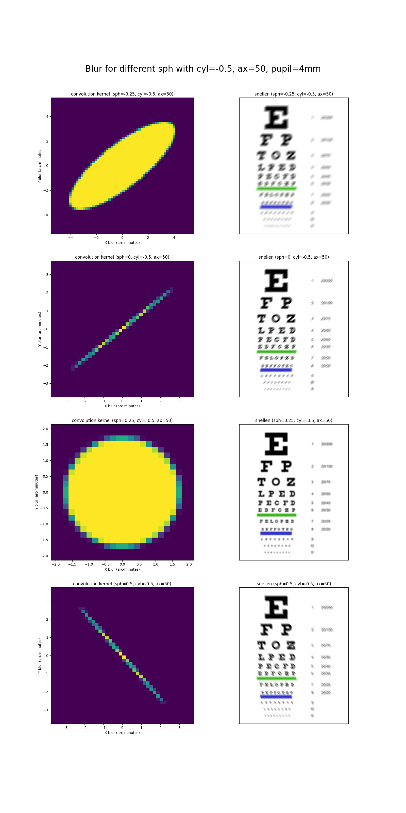
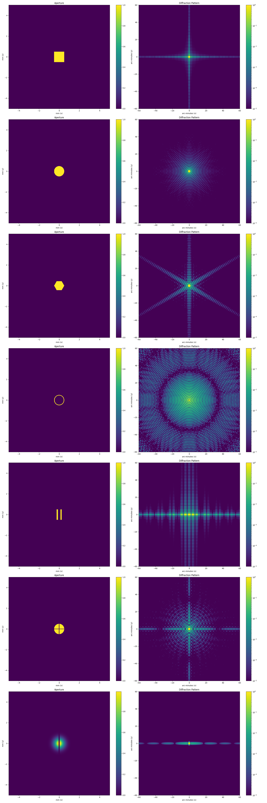

# Background

Around December 2022 I stumbled across natural vision improvement, in particular [EndMyopia](https://endmyopia.org), although these days I mostly engage with its open-source fork [Reduced Lens](https://reducedlens.org).

My background is in physics, software, and data science, and I'm particularly interested in getting to the bottom of vision improvement. 
On the one hand, there have been enough cases of significant optometrist improvements that I suspect vision improvement works, even in adults.
On the other hand, many of the available resources are pseudo-science and some of the improvement stories seem exaggerated.
Even the genuine improvement cases suffer from selection bias, as cases of people fail or plateau tend not to be reported.
In any case, vision improvement is a messy topic.

As I dived more into vision improvement, I started to read more from the scientific literature.
At one point I became curious about [monocular double vision](https://wiki.reducedlens.org/wiki/Double_vision), particulary because I experienced this phenomenon myself at times.
Was it mostly psychological/neurological, or was it physical?
Intuitively I knew from geometric optics that astigmatism should result in directional blur, not two perfectly clear images.
However, after searching the literature I came across [this paper](https://www.ncbi.nlm.nih.gov/pmc/articles/PMC2258122/), which claimed that two images could form after taking diffraction into account.

After reading that paper, I felt compelled to understand the optics behind vision at a deeper level, to the point where I could run diffraction simulations myself.
This repository is a collection of jupyter notebooks related to learning optics and applying it to vision.
I see this repo as more of a personal reference, but perhaps others may find it useful.

As a side note, I may want to compose other notes in the future, such as vision improvement strategies, documented cases of improvement, my own improvement anecdotes, or topics from the scientific literature.

## Geometric Optics

The notebook [Geometric_Optics_1_Intro](./Geometric_Optics_1_Intro.ipynb) introduces the matrix formulation of geometric optics and derives matrices for several different optic elements.

The notebook [Geometric_Optics_2_Defocus](./Geometric_Optics_2_Defocus.ipynb) derives analytic expressions for myopic and astigmatic defocus, as well as numerically simulating blur from different sph and cyl levels.
The Snellen Chart below shows simulated blur resulting from different refractive errors in the geometric optics framework, which does not take diffraction into account.

## Diffraction

After looking through several different textbooks, I found [Introduction to Fourier Optics](https://docs.google.com/file/d/0B78A_rsP6RDSS3VRWk12Y2FUcVk/edit?pli=1&resourcekey=0-EdJQY3UFbqEiJnqV8YDPNA) by Goodman to be a very readable introduction. 
I'd say it's on par with a typical first-year graduate physics course.

The notebook [Diffraction_1_Goodman_Ch3_Rayleigh_Sommerfeld](Diffraction_1_Goodman_Ch3_Rayleigh_Sommerfeld.ipynb) follows chapter 3 of Goodman, and derives the [Rayleigh Sommerfeld Diffraction Formula](https://en.wikipedia.org/wiki/Helmholtz_equation#Three-dimensional_solutions_given_the_function_on_a_2-dimensional_plane):
$$\psi(x,y,z) = - \frac{1}{2 \pi} \iint_{-\infty}^{\infty} \psi(x', y') \frac{e^{ikd}}{d} \frac{z}{d} \left( ik-\frac{1}{d} \right) dx' dy'$$

The notebook [Diffraction_2_Goodman_Ch4_Fresnel_Fraunhofer](./Diffraction_2_Goodman_Ch4_Fresnel_Fraunhofer.ipynb) derives the [Fresnel Diffraction Formula](https://en.wikipedia.org/wiki/Fresnel_diffraction):

$$\psi(x,y,z) = - \frac{ik}{2\pi} \frac{e^{ikz}}{z} \exp{ \left[ \frac{ik}{2}(x^2+y^2) \right] } \iint_{-\infty}^{\infty} \psi(x',y') \exp{ \left[ \frac{ik}{2z}(x'^2 + y'^2) \right] }  \exp{ \left[ \frac{-ik}{z}(xx'+yy') \right] }dx' dy'$$

This notebook then uses the Fraunhofer Approximation to calculate some examples of diffraction, including the ones below which were solved numerically:

The notebook [Diffraction_3_Goodman_Ch5_Lenses](./Diffraction_3_Goodman_Ch5_Lenses.ipynb) solves the equations involving lenses, including the derivation of the image equation:

$$\psi_i(x_o,y_o,x_i,y_i) = \frac{\psi_0}{\lambda^2 z_o z_i} \iint_{-\infty}^{\infty} P(x_l', y_l') \exp{ \left\{ -\frac{ik}{z_i} \left[ \left( x_i - M x_o \right) x_l' + \left(y_i - M y_o \right)y_l' \right] \right\} }dx_l' dy_l'$$
